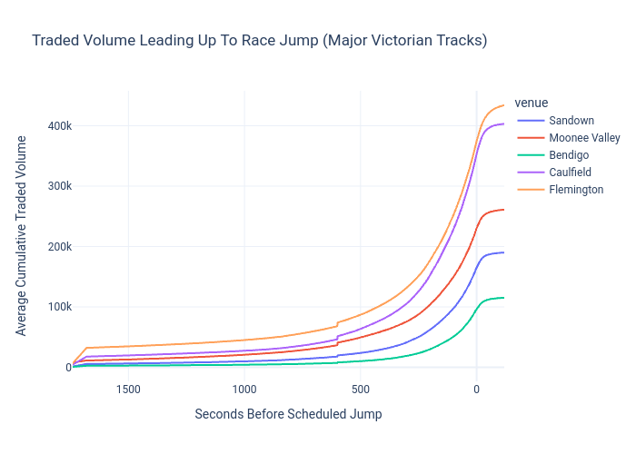

(**PLEASE** read limitations. There is only so much you can do on free data 😭)
# Methodology (Backtesting)

## Data
Via the [Historical Betfair Portal](https://historicdata.betfair.com.au) I downloaded Australian thoroughbred racing data, specifically filtering for WIN markets across August 2026 and the 
Basic tier package. Basic tier files only contain last traded price per update and do not include any order book depth such as back and lay prices or volume ladders which reduces the type of signal 
I can possibly use to flag.

## Flagging logic 
### Pre-Market

Each market is only evaluated in the last 90 seconds before a race begins via controlling **window_seconds** and **seconds_to_start** parameters with in-play updates excluded. 
I chose this specific window since it leaves enough room for multiple data updates (BASIC updates every 60 seconds) and that markets on racing are typically the most liquid, especially at larger racing venues like Randwick and Doomben. This also means that there is enough liquidity for whales to get filled on back contracts which would provide an arbitrage opportunity if such an event happened. 

  (Insert link to betfair market context) 

  

For a market that does have a jump time within the 90 seconds, during each market update, we loop through each runner and track their selection id, last price traded and the time remaining till jump. Because we only have last price traded to rely upon, we track a "percentage" drop.

$$ P_{drop} = \frac{P_{n} - P_{n-1}}{\Delta*t} *100$$

Additionally, we track a maximum on the lay prices for mainly two reasons. That being there isn't much liquidity on longshots which would impact how much of an order you would get filled at. Moreover, lay bets operate on a liability model:

$$\
X_{outcome}= 
\begin{cases} 
   \text{Loss} = S_{lay}*(1-t_{commission}) \\
   \text{Win} = -S_{lay} *(O_{lay}-1)
\end{cases}
\
$$

which means in the event that [slippage](https://en.wikipedia.org/wiki/Slippage_(finance)) happens, our liability should be low enough that the hedge should (at worst) result in a small loss. 

In the event that both conditions are fulfilled, we flag the horse.

### Post-Market

Because I don't have access to historical bookmaker odds (either because they simply aren't public or because they require money), we assume that the back bet on the bookmaker is the same price as the current - 1 lay price, which accounts for their model delay. The lay stake is calculated via conditioning on the horses outcome and assuming a [zero sum principle](https://en.wikipedia.org/wiki/Zero-sum_game). 

$$\
0 = 
\begin{cases} 
   \text{Loss}: Profit_{lay} - Stake_{back}) \\
   \text{Win}: Liability - Profit_{back})
\end{cases}
\
$$

or equivalently

$$\
Amount =  
\begin{cases} 
   \text{Loss}: S_{lay}*(1-t_{commission}) - S_{back} \\
   \text{Win}: S_{lay} * (O_{lay}-1) - S_{back} * (O_{back} -1)
\end{cases}
\
$$

by adding both equations, we get that:

$$0 = S_{lay} * (O_{lay}-1)  + S_{lay}*(1-t_{commission}) - S_{back} * (O_{back} -1) - S_{back} $$

which after simplifying:

$$ S_{lay}= \frac{S_{back} * O_{back}}{O_{lay} - t_{commission}} $$

This allows us to calculate the profit of the arbitrage (I used the condition if the horse loses but would result in the same answer regardless). 

$$ Profit = S_{lay}*(1-t_{commission}) - S_{back} $$

The profit of each flagged bet then gets appended to a cumulative wealth variable. 

