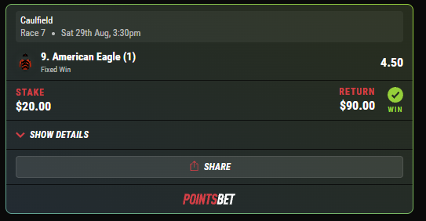
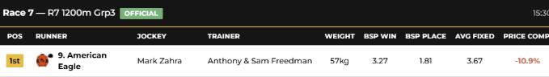
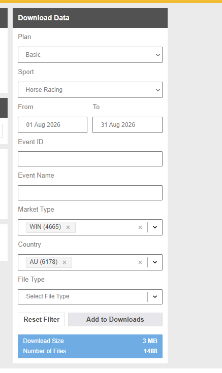
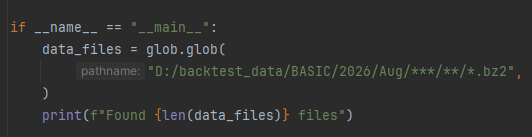
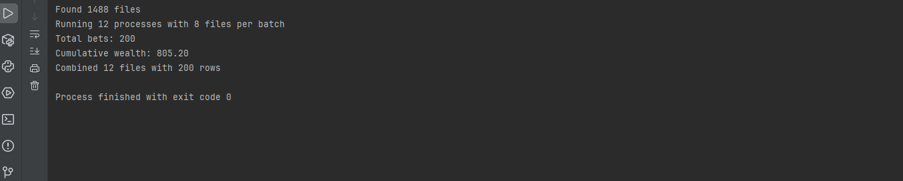
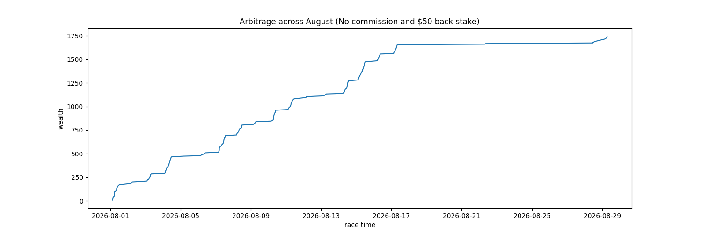

# About
This project is a proof of concept that uses the Flumine and Betfairlightweight API to identify whale behaviour in lay prices and calculate arbitrage between lay prices and delayed bookmaker odds. Below is one such example. This is a VERY simplified model and as such, isn't efficient irl.

Example for August 29, 2026 where back prices are suddenly filled before jump which leads to a low starting price while bookmakers delay behind:

  
  

## How to run backtest:

1. Download historical data from the [Betfair Exchange history portal](https://historicdata.betfair.com.au). This downloads as a tar file which you would have to unpack into multiple folders. You can reduce the size of the download by customising filters such as the market type and the country.

  

2.) Find this section of code and replace the path name with your path to the historical data.

  

3.) After running the code, it will return metrics such as the amount of bets placed and the cumulative wealth at the end of the backtest. 

4.) You can also choose to plot the backtest via [Plots.py](Plots.py) 

## Parameters:

|Parameter                  | Description                                                                                  |
|-----------------------------|----------------------------------------------------------------------------------------------|
